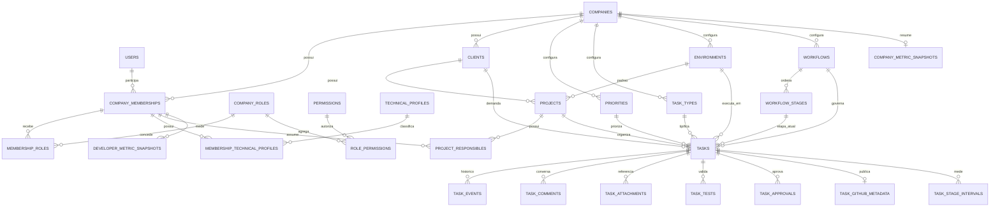

# Modelo relacional do DevFlow

Este documento materializa o [Documento 003](../functional/document-003.md).

## Regras físicas

- UUID para entidades públicas;
- `TIMESTAMPTZ` para datas;
- `company_id` em todas as entidades de domínio;
- FKs compostas para isolamento;
- índices iniciados por `company_id`;
- `ON DELETE RESTRICT` para dossiês e catálogos referenciados;
- exclusão lógica com `deleted_at` ou arquivamento com `is_active`;
- triggers append-only para eventos, comentários, testes, aprovações e auditoria;
- `JSONB` somente para requisitos declarativos, snapshots e valores de auditoria, não
  para substituir relações centrais.

## Estratégia de evolução

Como ainda não há instalação produtiva homologada, a migration inicial pode incorporar
o modelo completo. Depois da primeira release estável, qualquer mudança será adicionada
em uma nova migration forward-only; migrations já aplicadas não serão reescritas.
