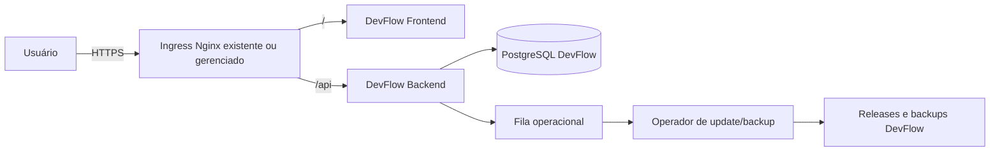

# Arquitetura proposta do DevFlow

## 1. Objetivos

O DevFlow seguirá a mesma filosofia do Full Password:

- aplicação web em monorepo;
- responsabilidades separadas;
- segurança aplicada em múltiplas camadas;
- infraestrutura reproduzível;
- UX familiar;
- operação administrável sem SSH recorrente.

Não haverá compartilhamento de código, banco, volumes, segredos ou domínio de negócio.

## 2. Contexto



## 3. Containers lógicos

### Frontend

SPA React compilada como arquivos estáticos. Responsabilidades:

- navegação e estado visual;
- validação de ergonomia;
- espelho das permissões para UX;
- nenhuma decisão de autorização definitiva;
- nenhuma persistência de segredo em storage do navegador.

### Backend

API Express. Responsabilidades:

- autenticação, sessão e MFA;
- autorização;
- regras de negócio;
- auditoria;
- acesso ao banco;
- contratos de backup e update;
- validação de payload e limites.

### Banco

PostgreSQL exclusivo do DevFlow:

- database, usuário e volume próprios;
- schema versionado;
- migrations forward-only;
- nenhuma consulta cruzada ao Full Password.

### Operador

Processo isolado para update e backup:

- recebe apenas comandos internos versionados;
- allowlist de operações;
- lock de concorrência;
- privilégio mínimo;
- sem parâmetros de shell fornecidos pelo navegador;
- toda execução auditada.

## 4. Camadas do backend

Dependências permitidas:

```text
routes -> middleware -> controllers -> services -> repositories/database
                                      -> domain policies
```

- `routes`: método, caminho, middleware e handler.
- `middleware`: autenticação e controles transversais.
- `controllers`: parsing, validação de contrato e resposta.
- `services`: casos de uso e transações.
- `repositories`: SQL e mapeamento de persistência, introduzidos quando o primeiro módulo for modelado.
- `config`: ambiente validado e imutável após startup.
- `utils`: funções puras, sem regra de negócio.

Um controller não pode montar SQL nem decidir permissão diretamente.

## 5. Camadas do frontend

```text
pages -> feature components -> shared components
      -> hooks/context -> services -> API
```

- páginas coordenam rotas e estados de alto nível;
- features agrupam comportamento do domínio;
- componentes compartilhados são visuais e acessíveis;
- serviços encapsulam HTTP e criptografia;
- contextos globais são limitados a sessão, tema e capacidades globais.

Meta: nenhum componente de feature acima de 400 linhas sem ADR justificando.

## 6. Modelo de identidade e acesso

- flag persistida `is_super_admin` para ações críticas;
- papéis administrativos amplos;
- capacidades por recurso para `view`, `add`, `edit`, `delete` e ações específicas;
- política backend-first;
- leitura negada pode ser mascarada como 404;
- alterações de acesso incrementam `token_version` quando afetam sessão;
- decisões relevantes entram na auditoria.

O modelo de recursos será definido com o domínio do primeiro módulo. Não serão criadas tabelas genéricas de “permissão” antes disso.

## 7. Dados e transações

- IDs UUID para entidades expostas.
- Datas em `TIMESTAMPTZ` e API em ISO 8601.
- E-mail normalizado e unicidade case-insensitive.
- Transação para operações multi-entidade.
- Advisory lock para bootstrap, scheduler e atualização.
- Exclusão lógica por padrão; purga exige política de retenção.
- Chaves estrangeiras com `CASCADE`, `RESTRICT` ou `SET NULL` explicitamente justificadas.

## 8. Criptografia

A filosofia zero-knowledge não será aplicada automaticamente a todo dado do DevFlow. Cada módulo terá classificação:

1. público;
2. interno;
3. confidencial;
4. segredo.

Segredos exigem envelope AES-256-GCM, chave fora do banco e rotação planejada. Criptografia no navegador será usada quando o threat model exigir que o servidor não conheça o texto claro. Senhas de login sempre usam Argon2id, nunca criptografia reversível.

## 9. Observabilidade

- logs estruturados com request ID;
- nenhum segredo, corpo sensível ou stack em produção;
- audit trail separado do log técnico;
- healthchecks de liveness e readiness;
- métricas de latência, erro, fila, backup e update;
- retenção e acesso definidos antes da produção.

## 10. Compatibilidade

DevFlow usa:

- nome Compose `devflow`;
- rede, containers, volumes e banco próprios;
- portas internas e bind em loopback quando necessário;
- domínio e certificado próprios;
- configuração Nginx aditiva.

O Full Password é apenas um consumidor vizinho da infraestrutura. Uma falha do DevFlow não pode causar restart, rebuild ou migração nele.

## 11. Gates arquiteturais

Antes do primeiro endpoint:

- modelo de domínio e diagrama de dados;
- threat model;
- matriz de capacidades;
- contrato de auditoria;
- estratégia de migração;
- critérios de backup/restauração;
- protótipo de UI aprovado;
- teste de coexistência em laboratório.
