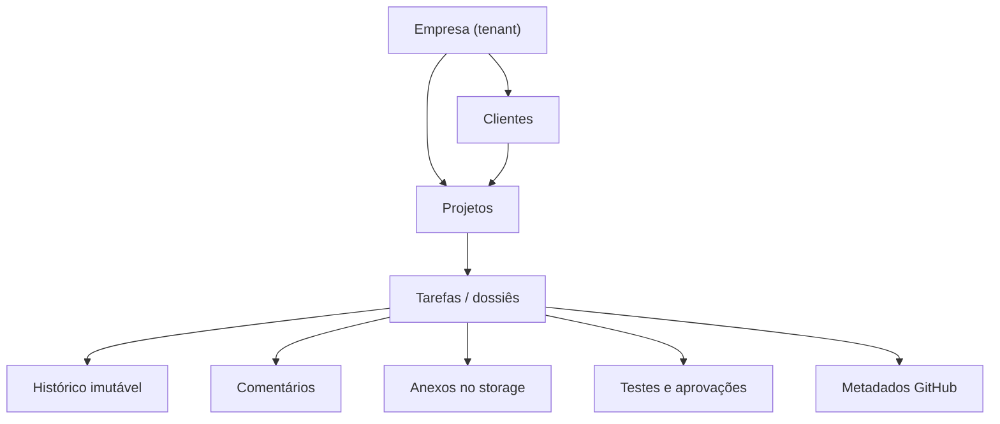

# DOCUMENTO 003 — Modelo de Dados

Status: aprovado como evolução estrutural do Documento 002.
Data de incorporação: 2026-07-29.

## 1. Objetivo

O modelo de dados do DevFlow deve permitir que a aplicação evolua de uma instalação com
uma única empresa para uma plataforma multi-tenant, sem migração estrutural invasiva.
Clientes, projetos, tarefas, fluxos, catálogos, histórico e métricas pertencem sempre a
uma empresa.

A tarefa é tratada como um dossiê técnico permanente, não apenas como um cartão de
Kanban.

## 2. Princípios

1. Identidade de usuário é global; acesso e papéis são concedidos por empresa.
2. Toda entidade de negócio carrega `company_id` e toda consulta aplica esse escopo.
3. O tenant nunca é aceito diretamente do corpo da requisição; ele vem da sessão.
4. Clientes, projetos, ambientes, tipos, prioridades e fluxos são dados configuráveis.
5. Registros históricos não são apagados fisicamente.
6. Catálogos em uso são desativados, não excluídos.
7. Histórico da tarefa e auditoria da plataforma são trilhas separadas.
8. Métricas são servidas por snapshots pré-calculados.
9. Alterações de fluxo preservam a configuração usada por tarefas existentes.

## 3. Hierarquia de domínio

## 4. Identidade e acesso

### Usuários

`users` armazena somente identidade global, credencial, proteção do Super Admin, MFA e
controle de versão de token.

### Empresas e associações

`companies` representa o tenant. `company_memberships` associa usuários a empresas,
controla ativação e define a empresa padrão.

Um usuário pode participar de várias empresas. Uma sessão possui uma única
`company_id` ativa.

### Papéis e permissões

- `permissions`: catálogo global de capacidades versionadas;
- `company_roles`: papéis configuráveis por empresa;
- `role_permissions`: capacidades de cada papel;
- `membership_roles`: papéis concedidos à associação;
- `technical_profiles`: perfis técnicos configuráveis por empresa;
- `membership_technical_profiles`: perfis técnicos da associação.

Os papéis iniciais são `ADMIN` e `USER`. Os perfis iniciais são Backend, Frontend e
Gestor. QA, DevOps, UX/UI, Product Owner e Suporte podem ser adicionados sem alterar o
schema.

## 5. Clientes e projetos

### Clientes

`clients` é independente e pertence à empresa. Um cliente pode possuir vários projetos.
Clientes em uso são arquivados logicamente.

### Projetos

Cada projeto possui:

- empresa e cliente;
- nome, código e descrição;
- repositório GitHub;
- ambiente padrão;
- responsáveis;
- status;
- datas de criação e atualização.

`project_responsibles` permite vários responsáveis com funções como Backend, Frontend,
Gestor, QA ou outra função futura.

## 6. Catálogos configuráveis

### Ambientes

`environments` substitui o enum fixo. Cada empresa recebe inicialmente Desenvolvimento,
Homologação, Produção, Cliente específico e Local.

### Tipos de tarefa

`task_types` substitui o enum fixo e informa se o tipo é aplicável a Solicitação, Bug ou
ambos.

### Prioridades

`priorities` contém nome, peso de produtividade, ordem e token visual. Os valores
iniciais reproduzem o Documento 002.

Catálogos referenciados não são removidos; `is_active` controla disponibilidade para
novas tarefas.

## 7. Fluxos configuráveis

`workflows` define um fluxo por empresa e tipo de demanda. `workflow_stages` define:

- nome e código estável;
- ordem;
- regra de responsabilidade;
- requisitos declarativos em JSON;
- início do cronômetro;
- conclusão da tarefa;
- ativação.

O fluxo inicial reproduz:

`Roadmap/Report Bug → Backend → Frontend → Update GitHub → Testando → Revisando → Produção`.

Novos fluxos, como Mobile, API, Hotfix ou Cliente VIP, podem ser cadastrados sem alterar
o código. Tarefas existentes mantêm o `workflow_id` e as etapas não podem ser apagadas
fisicamente.

## 8. Tarefa como dossiê técnico

`tasks` referencia:

- empresa;
- cliente e projeto;
- tipo, prioridade e ambiente;
- fluxo e etapa atual;
- solicitante;
- responsáveis Backend e Frontend;
- tarefa de origem, quando um Bug for consequência de outra entrega.

O dossiê agrega:

- `task_stage_intervals`;
- `task_stage_submissions`;
- `task_tests`;
- `task_approvals`;
- `task_github_metadata`;
- `task_comments`;
- `task_attachments`;
- `task_events`.

Ao consultar uma tarefa, a API entrega contexto suficiente para responder quem pediu,
quem desenvolveu, quem aprovou, quais testes foram feitos, qual commit e release foram
publicados, quais bugs surgiram, quanto tempo foi consumido, quais arquivos foram
anexados e qual foi a conversa da equipe.

## 9. Histórico e auditoria

`task_events` é o histórico do dossiê e sempre possui `task_id`.

`audit_events` é a trilha exclusiva da plataforma: autenticação, autorização,
administração, catálogos, usuários, projetos e operações sensíveis.

Ambas são append-only, protegidas por trigger contra `UPDATE` e `DELETE`.

## 10. Anexos e storage

O banco armazena metadados, hash, tenant, tarefa e chave do objeto. O conteúdo permanece
em storage privado. A implementação inicial usa volume Docker isolado; a chave de
storage permite migração futura para S3 ou serviço equivalente.

## 11. Métricas

Dashboards não executam agregações completas a cada acesso.

- `company_metric_snapshots`: indicadores gerais por empresa;
- `developer_metric_snapshots`: indicadores por associação/desenvolvedor;
- `metric_refresh_state`: versão, janela e resultado do último processamento.

Um agregador idempotente recalcula snapshots em intervalo controlado e após eventos
relevantes. O dashboard lê somente os snapshots.

## 12. Isolamento multi-tenant

- FKs compostas validam que relacionamentos pertencem à mesma empresa.
- Serviços filtram por `company_id` da sessão.
- IDs de outro tenant são respondidos como não encontrados.
- anexos usam prefixo/chave segregada por empresa;
- métricas, auditoria e notificações são escopadas;
- sessão trocada de empresa recebe novo contexto e novo token.

Row-Level Security no PostgreSQL é uma camada futura de hardening; a baseline já evita
consultas sem tenant nos repositórios de domínio.

## 13. Dados iniciais da primeira empresa

No bootstrap são criados transacionalmente:

- empresa inicial;
- associação do Super Admin;
- papéis Admin e Usuário;
- permissões padrão;
- perfis Backend, Frontend e Gestor;
- ambientes, prioridades e tipos do Documento 002;
- fluxos padrão de Solicitação e Bug.

Nenhuma empresa, projeto ou cliente de demonstração é criada automaticamente.

## 14. Critérios de aceite

- uma tarefa nunca referencia dados de outra empresa;
- fluxo e catálogos podem ser ampliados sem migration;
- uma mesma identidade pode alternar entre empresas autorizadas;
- tarefas existentes sobrevivem à desativação de catálogos;
- o dossiê pode ser reconstruído integralmente;
- histórico e auditoria permanecem imutáveis;
- dashboard não agrega todo o domínio no caminho de leitura;
- a empresa única inicial funciona sem exigir conhecimento de multi-tenancy do usuário.
