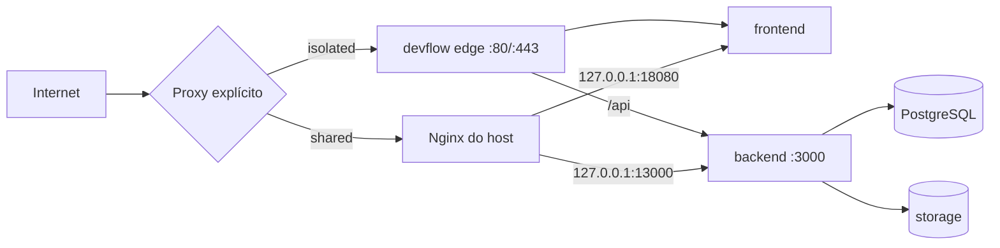

# Arquitetura de infraestrutura

## Topologias suportadas

No modo isolado, o edge pertence ao Compose DevFlow. No compartilhado, o Nginx do host mantém 80/443 e os serviços DevFlow publicam somente em loopback. Um Nginx containerizado de terceiros não é integrado automaticamente.

## Serviços

| Serviço | Responsabilidade | Persistência | Healthcheck |
|---|---|---|---|
| `db` | PostgreSQL | `/opt/devflow/data/postgres` | `pg_isready` |
| `backend` | API, autenticação e regras | uploads externos | `/health` com versão e migration |
| `frontend` | SPA estática | nenhuma | `/healthz` |
| `edge` | TLS e roteamento isolado | certificados somente leitura | `/healthz` HTTPS |

Worker e fila não existem nesta baseline; não são descritos como concluídos.

## Redes, volumes e portas

O Compose usa a rede privada `devflow_internal`, sem publicar PostgreSQL. Os binds de banco e storage apontam para diretórios persistentes fora das releases. No desenvolvimento local, os valores padrão usam volumes nomeados.

No modo compartilhado, frontend e backend ficam em `127.0.0.1` nas portas configuradas. No isolado, somente o edge publica 80/443.

## Configuração e segredos

O contrato versionado é `.env.example`. Na VPS, `/opt/devflow/config/devflow.env` possui modo `0600`; backup e bootstrap usam arquivos separados com a mesma proteção. Segredos vêm de `openssl rand`, não são colocados no Compose ou nos logs e nunca são commitados.

## Releases

Cada instalação arquiva o commit Git em `/opt/devflow/releases/<sha>`. O link `app.candidate` é usado durante build, migration e healthchecks; `app` só muda depois do sucesso. A configuração e os dados não residem na release.

## HTTPS

Certbot emite certificado exclusivo para o domínio. No modo isolado, usa desafio standalone antes do edge. No compartilhado, usa webroot e um virtual host temporário gerenciado. Uma candidata Nginx inválida restaura o arquivo anterior antes de qualquer reload.

## Segurança operacional

- nenhum socket Docker no backend;
- containers non-root quando compatível com a imagem;
- capabilities reduzidas e `no-new-privileges` no Compose;
- nenhum prune global;
- nenhuma manipulação de firewall;
- nenhuma remoção de Docker ou certificado na desinstalação;
- nenhuma operação no repositório ou containers Full Password.

## Persistência

| Caminho | Persistente | Removido por `--keep-data` | Removido por `--purge` |
|---|---:|---:|---:|
| `/opt/devflow/config` | sim | não | sim, após confirmações |
| `/opt/devflow/data` | sim | não | sim, após backup |
| `/opt/devflow/storage` | sim | não | sim, após backup |
| `/opt/devflow/backups` | sim | não | sim; copiar antes |
| `/opt/devflow/releases` | operacional | não | sim |

Docker global, certificados e qualquer recurso Full Password são preservados em todos os modos.
