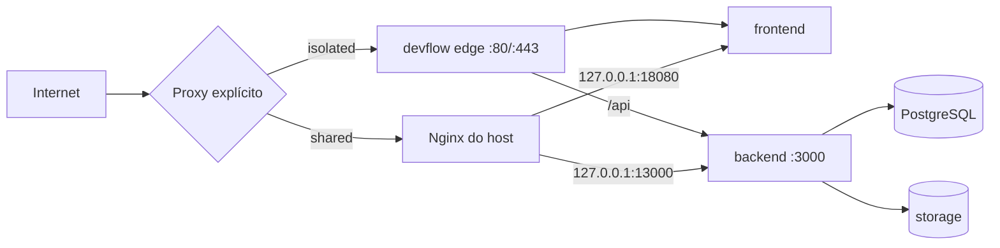

# Arquitetura de infraestrutura

## Topologias suportadas

No modo isolado, o edge pertence ao Compose DevFlow. No compartilhado homologável nesta versão, o Nginx do host mantém 80/443 e os serviços DevFlow publicam somente em loopback. Um Nginx containerizado ou Caddy é inventariado, mas não integrado automaticamente.

## Serviços

| Serviço | Responsabilidade | Persistência | Healthcheck |
|---|---|---|---|
| `db` | PostgreSQL | `/opt/devflow/data/postgres` | `pg_isready` |
| `backend` | API, autenticação e regras | uploads externos | `/health` com versão e migration |
| `frontend` | SPA estática | nenhuma | `/healthz` |
| `edge` | TLS e roteamento isolado | certificados somente leitura | `/healthz` HTTPS |
| `maintenance` | resposta temporária HTTPS 503 durante update isolado | nenhuma | `nginx -t` |

Worker e fila não existem nesta baseline; não são descritos como concluídos.

## Redes, volumes e portas

O Compose usa `devflow_edge` para tráfego de aplicação e `devflow_internal` para banco/backend. A rede interna não oferece acesso direto externo e o PostgreSQL não publica portas. Os binds de banco e storage apontam para diretórios persistentes fora das releases; no desenvolvimento local, os valores padrão usam volumes nomeados.

No modo compartilhado, frontend e backend ficam em `127.0.0.1` nas portas configuradas. No isolado, somente o edge publica 80/443. `devflow_edge` conecta frontend, backend e edge; `devflow_internal` é marcada como interna e conecta somente backend e PostgreSQL. O banco não participa da rede de borda.

## Configuração e segredos

O contrato versionado é `.env.example`. Na VPS, `/opt/devflow/config/devflow.env` possui modo `0600`; backup e bootstrap usam arquivos separados com a mesma proteção. Segredos vêm de `openssl rand`, não são colocados no Compose ou nos logs e nunca são commitados.

## Releases e checkout operacional

Cada instalação arquiva o commit Git em `/opt/devflow/releases/<sha>`. O link `app.candidate` identifica a candidata durante build, migration e healthchecks; `app` só muda depois do sucesso interno. Se um gate posterior falhar, o backup e a release anterior são restaurados automaticamente.

O instalador cria `/opt/devflow/source`, checkout operacional de `main` pertencente a `root`, sem hooks e sem permissão de escrita para grupo/terceiros. Ele existe somente para fetch e fast-forward de commits publicados pelo desenvolvimento Windows. O remote é o HTTPS público canônico e não utiliza credenciais.

Durante update, backend e frontend ficam parados e o tráfego recebe `503`. No modo isolado, `docker-compose.maintenance.yml` assume 80/443; no compartilhado suportado, somente o arquivo DevFlow é substituído atomicamente depois de `nginx -t`. Falha de reload restaura e recarrega a configuração anterior.

## HTTPS

Certbot emite certificado exclusivo para o domínio. No modo isolado, usa desafio standalone antes do edge. No compartilhado, usa webroot e um virtual host temporário gerenciado. Uma candidata Nginx inválida restaura o arquivo anterior antes de qualquer reload.

## Segurança operacional

- nenhum socket Docker no backend;
- containers non-root quando compatível com a imagem;
- capabilities reduzidas e `no-new-privileges` no Compose;
- nenhum prune global;
- nenhuma manipulação de firewall;
- nenhuma remoção de Docker ou certificado na desinstalação;
- nenhuma operação no repositório ou containers Full Password.

## Persistência

| Caminho | Persistente | Removido por `--keep-data` | Removido por `--purge` |
|---|---:|---:|---:|
| `/opt/devflow/config` | sim | não | sim, após confirmações |
| `/opt/devflow/data` | sim | não | sim, após backup |
| `/opt/devflow/storage` | sim | não | sim, após backup |
| `/opt/devflow/backups` | sim | não | sim; copiar antes |
| `/opt/devflow/releases` | operacional | não | sim |
| `/opt/devflow/source` | operacional | não | sim |

Docker global, certificados e qualquer recurso Full Password são preservados em todos os modos.
